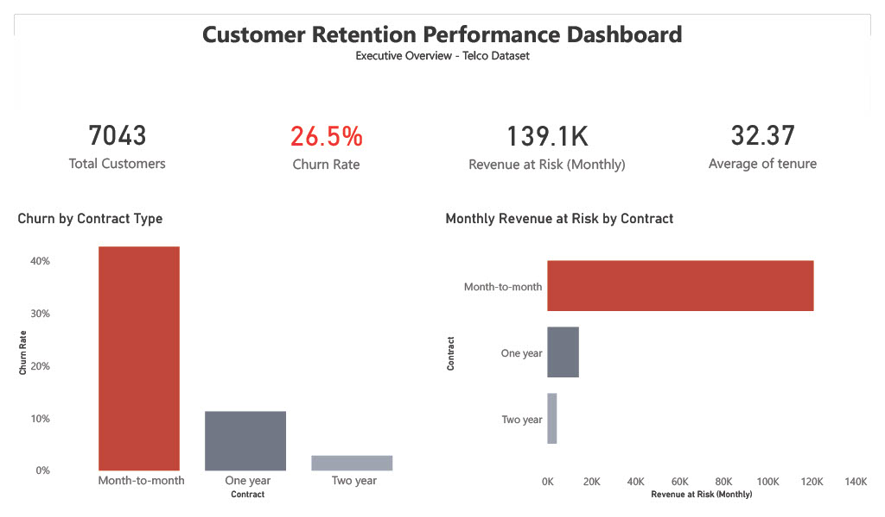
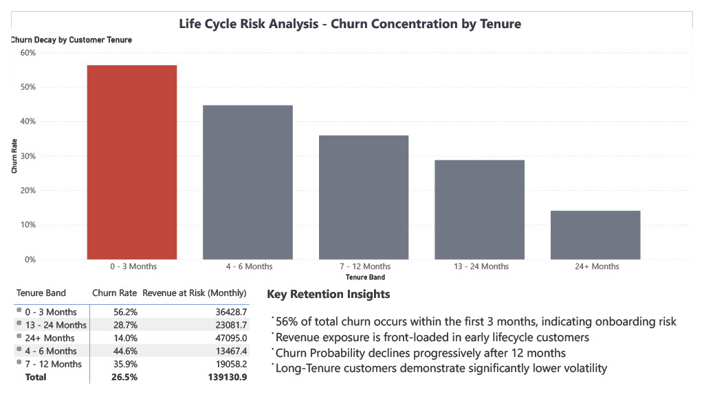

# Future DS 02 — Customer Retention & Churn Risk Analysis

## Project Overview
This project analyzes customer churn behavior within a telecommunications dataset to identify revenue risk drivers, lifecycle instability, and structural retention vulnerabilities. The analysis was conducted using Power BI with data modeling and DAX calculations.

## Objectives
- Measure overall churn rate
- Identify high-risk customer segments
- Quantify monthly revenue at risk
- Analyze churn concentration across lifecycle stages
- Evaluate the impact of contract structure on retention stability

## Key Metrics
- Total Customers: 7,043  
- Overall Churn Rate: 26.54%  
- Monthly Revenue at Risk: 139K  
- Highest Risk Segment: 0–3 Months, Month-to-Month contracts  

## Key Findings
- Churn is heavily front-loaded, with 56% occurring within the first three months.
- Month-to-month contracts account for 87% of total revenue at risk.
- Retention stabilizes significantly after 12 months.
- Early-stage, low-commitment customers drive the majority of revenue volatility.

## Business Interpretation
Churn is structurally concentrated in early-stage, low-commitment customers, creating front-loaded revenue instability. The findings indicate that onboarding effectiveness and contract commitment are critical factors influencing long-term retention performance.

## Tools & Techniques
- Power BI (Data modeling and dashboard development)
- DAX (Churn rate and revenue at risk calculations)
- Power Query (Data transformation and lifecycle segmentation)

## Repository Structure
```
FUTURE_DS_02/
│
├── dashboard/
│   ├── FUTURE_DS_02.pbix
│   ├── executive-overview.png
│   └── retention-deep-dive.png
│
├── data/
│   └── WA_Fn-UseC_-Telco-Customer-Churn.csv
│
├── report/
│   └── FUTURE_DS_02.pdf
│
└── README.md
```

## Dashboard Preview

### Executive Overview


### Retention Deep Dive


## Conclusion
The analysis demonstrates that retention instability is primarily driven by early lifecycle churn among low-commitment customers. Addressing early-stage engagement represents the most significant opportunity to improve revenue predictability.
